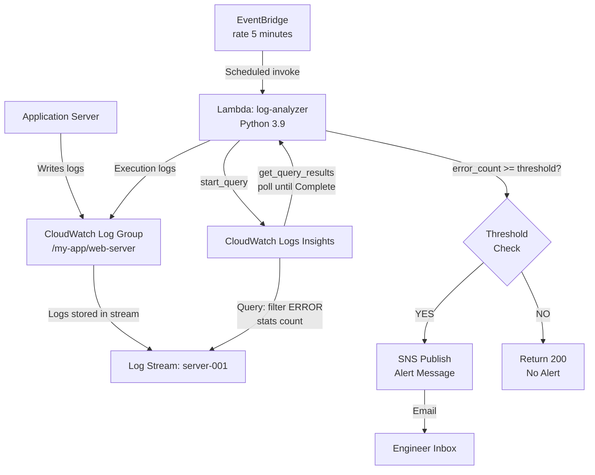
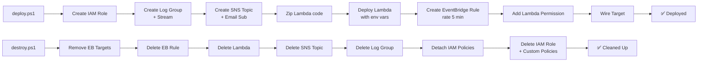

<div align="center">

#  CloudWatch Log Analytics System

### Serverless Observability Pipeline on AWS

**Automated log intelligence that detects ERROR spikes, triggers real-time SNS alerts, and self-deploys end-to-end — zero manual ops required.**

---


</div>

---

## 📋 Table of Contents

- [Project Overview](#-project-overview)
- [Key Features](#-key-features)
- [Architecture](#-architecture)
- [Tech Stack](#-tech-stack)
- [Repository Structure](#-repository-structure)
- [How It Works](#-how-it-works)
- [Installation & Setup](#-installation--setup)
- [CloudWatch Insights Queries](#-cloudwatch-insights-queries)
- [Engineering Challenges Solved](#-engineering-challenges-solved)
- [Security & Best Practices](#-security--best-practices)
- [Screenshots](#-screenshots)
- [Future Improvements](#-future-improvements)
- [Learning Outcomes](#-learning-outcomes)
- [Why This Project Stands Out](#-why-this-project-stands-out)
- [Author](#-author)

---

## 🎯 Project Overview

The **CloudWatch Log Analytics System** is a fully serverless observability pipeline built on AWS that automates error detection, log querying, and alerting — without any persistent servers or manual operator intervention.

### The Problem It Solves

In production systems, application errors buried inside CloudWatch logs often go unnoticed until a user reports an outage. Manual log review is slow, error-prone, and doesn't scale. On-call engineers need **automated, threshold-based alerting** the moment error rates spike.

### What This System Does

- Ingests application logs into **AWS CloudWatch Logs** under a structured log group (`/my-app/web-server`)
- Periodically executes a **CloudWatch Logs Insights** query via a Python Lambda function to count ERROR-level log entries over the last hour
- Compares the result against a configurable **error threshold**
- Publishes a detailed alert message to an **SNS topic** (email) when the threshold is breached
- The entire infrastructure — IAM roles, log groups, SNS subscriptions, Lambda, and EventBridge scheduling — is provisioned and torn down through scripted PowerShell automation

### Business Value

| Without This System | With This System |
|---|---|
| Engineers check logs manually | Automated error detection every 5 minutes |
| Alerts lag by hours | Sub-minute notification after threshold breach |
| Infrastructure sprawl after testing | One-command teardown via `destroy.ps1` |
| No audit trail of alert frequency | Lambda logs every query run in CloudWatch |

---

## ✨ Key Features

### 🔴 Real-Time Error Detection
The Lambda function queries CloudWatch Logs Insights using a time-windowed filter (`last 1 hour`) to count messages matching the `/ERROR/` pattern. The query uses `stats count()` for an aggregated, efficient result rather than scanning raw log lines.

### ⚡ EventBridge-Driven Scheduling
An EventBridge rule triggers the Lambda function on a `rate(5 minutes)` schedule — meaning the system continuously sweeps logs without any human action. The invocation is fully event-driven, producing zero idle compute cost.

### 📬 Configurable SNS Alerting
When error count ≥ configurable threshold, an SNS `publish` call sends a formatted alert email including log group name, time period, error count, and threshold value. The threshold is environment-variable-driven, making it override-able per deployment without touching code.

### 🛡️ Environment-Variable Configuration
All sensitive configuration (log group name, SNS topic ARN, error threshold) is injected via Lambda environment variables — keeping secrets and config out of source code.

### 🏗️ Fully Scripted Infrastructure (IaC via PowerShell)
`deploy.ps1` provisions the complete AWS stack in one run:
- IAM role creation + policy attachment
- CloudWatch Log Group + Stream
- SNS Topic + Email subscription
- Lambda packaging (zip), creation, and environment config
- EventBridge rule + Lambda permission + target wiring

`destroy.ps1` cleanly removes every resource — Lambda, EventBridge rule, SNS topic, Log Group, IAM role, and all custom policies — preventing runaway AWS costs.

### 🔁 Resilient Query Polling
The Lambda implements a polling loop (up to 15 attempts, 1-second intervals) waiting for the CloudWatch Insights query to reach `Complete` status. Non-complete queries raise a descriptive exception, preventing silent failures.

### 📦 Zero-Dependency Deployment
The Lambda handler uses only `boto3`, `json`, `time`, and `os` — all natively available in the Lambda Python 3.9 runtime. No dependency packaging or `requirements.txt` needed.

---

## 🏛️ Architecture

### System Architecture Overview

```
┌─────────────────────────────────────────────────────────────────┐
│                        AWS Cloud (us-east-1)                    │
│                                                                 │
│   ┌──────────────┐     rate(5 min)    ┌───────────────────┐    │
│   │  EventBridge │ ─────────────────► │   AWS Lambda      │    │
│   │    Rule      │                    │  (log-analyzer)   │    │
│   └──────────────┘                    │  Python 3.9       │    │
│                                       └────────┬──────────┘    │
│                                                │               │
│                          ┌─────────────────────┤               │
│                          │                     │               │
│                          ▼                     ▼               │
│              ┌───────────────────┐   ┌──────────────────┐     │
│              │  CloudWatch Logs  │   │    SNS Topic     │     │
│              │  Insights API     │   │  (log-alerts)    │     │
│              │                   │   └────────┬─────────┘     │
│              │  Query:           │            │               │
│              │  filter ERROR     │            ▼               │
│              │  stats count()    │   ┌──────────────────┐     │
│              └─────────┬─────────┘   │  Email Alert     │     │
│                        │             │  (Engineer)      │     │
│                        ▼             └──────────────────┘     │
│              ┌───────────────────┐                            │
│              │  Log Group:       │                            │
│              │ /my-app/web-server│                            │
│              │  Stream: srv-001  │                            │
│              └───────────────────┘                            │
│                                                               │
│   ┌──────────────────────────────────────────┐               │
│   │  IAM Role: log-analyzer-role             │               │
│   │  Policies:                               │               │
│   │  • AWSLambdaBasicExecutionRole           │               │
│   │  • log-analyzer-logs-policy (custom)     │               │
│   │  • log-analyzer-sns-policy (custom)      │               │
│   └──────────────────────────────────────────┘               │
└─────────────────────────────────────────────────────────────────┘
```

### Monitoring Pipeline Data Flow



### Deployment Flow



---

## 🛠️ Tech Stack

### ☁️ Cloud Platform
| Service | Role |
|---|---|
| AWS Lambda | Serverless compute for log query execution |
| AWS CloudWatch Logs | Log storage and Insights query engine |
| AWS CloudWatch Logs Insights | SQL-like query language for log analytics |
| Amazon SNS | Alert notification (email protocol) |
| Amazon EventBridge | Cron-like scheduled invocation of Lambda |
| AWS IAM | Least-privilege role and policy management |

### 🐍 Backend
| Technology | Version | Usage |
|---|---|---|
| Python | 3.9 | Lambda handler runtime |
| boto3 | AWS SDK | CloudWatch Logs, SNS API calls |
| os / time / json | stdlib | Env var access, query polling, response serialization |

### ⚙️ Automation & IaC
| Technology | Usage |
|---|---|
| PowerShell | Scripted AWS CLI infrastructure provisioning |
| AWS CLI | Resource creation commands called from PowerShell |

---

## 📁 Repository Structure

```
CloudWatch-log-Analytics-System/
│
├── lambda_function.py        # Core Lambda handler — queries CloudWatch Logs
│                             # Insights, evaluates error threshold, publishes SNS alert
│
├── lambda_function.zip       # Pre-packaged deployment artifact for Lambda upload
│
├── deploy.ps1                # Full infrastructure provisioning script (IaC)
│                             # Creates: IAM Role, Log Group, SNS Topic,
│                             # Lambda, EventBridge Rule — in sequence
│
└── destroy.ps1               # Full teardown script — removes all AWS resources
                              # in reverse dependency order to avoid orphaned resources
```

**Why this structure matters:** The three-file design reflects a core DevOps principle — infrastructure lifecycle management. Every resource that `deploy.ps1` creates has a corresponding deletion step in `destroy.ps1`, demonstrating cost-conscious cloud engineering.

---

## ⚙️ How It Works

### Step 1 — Log Ingestion
Application logs are written to CloudWatch Log Group `/my-app/web-server`, Log Stream `server-001`. In production this would be an EC2 instance, ECS container, or API Gateway access log.

### Step 2 — Scheduled Invocation
Amazon EventBridge fires a `rate(5 minutes)` rule, which invokes the `log-analyzer` Lambda function. EventBridge permission to call Lambda is explicitly granted via `lambda:InvokeFunction` with the EventBridge service principal.

### Step 3 — CloudWatch Logs Insights Query
The Lambda issues a `start_query` API call against the log group for the previous 1-hour window:

```
fields @timestamp, @message
| filter @message like /ERROR/
| stats count()
```

This returns a `queryId` immediately — the query runs asynchronously on the CloudWatch backend.

### Step 4 — Resilient Query Polling
A `while` loop polls `get_query_results(queryId)` every second, waiting for status to leave `Running`/`Scheduled`. Up to 15 attempts are made before raising a timeout exception, ensuring the Lambda doesn't silently succeed with incomplete data.

### Step 5 — Threshold Evaluation
The aggregated `count()` result is compared against the `ERROR_THRESHOLD` environment variable (default: `1`). This threshold is configurable per deployment without code changes.

### Step 6 — Conditional SNS Alert
If `error_count >= error_threshold`, the Lambda calls `sns.publish()` with a structured message containing the log group, time period, error count, and threshold — giving the on-call engineer full context to immediately investigate in CloudWatch Logs Insights.

### Step 7 — Structured Response
The Lambda returns a `200` JSON response with `error_count` and `alert_sent` fields — useful for downstream processing, Lambda Destinations, or audit logging via CloudWatch.

---

## 🚀 Installation & Setup

### Prerequisites

- AWS Account with CLI configured (`aws configure`)
- AWS CLI v2 installed
- PowerShell (Windows) or PowerShell Core (Linux/macOS)
- IAM permissions: Lambda, CloudWatch Logs, SNS, IAM, EventBridge

### 1. Clone the Repository

```bash
git clone https://github.com/Akhilreddy175/CloudWatch-log-Analytics-System.git
cd CloudWatch-log-Analytics-System
```

### 2. Configure Variables in `deploy.ps1`

Open `deploy.ps1` and update these values:

```powershell
$Region        = "us-east-1"              # Target AWS region
$EmailAddress  = "your-email@example.com" # Alert recipient email
$LogGroupName  = "/my-app/web-server"     # Log group to monitor
$SnsTopicName  = "log-alerts"             # SNS topic name
$FunctionName  = "log-analyzer"           # Lambda function name
```

### 3. Deploy the Full Stack

```powershell
.\deploy.ps1
```

The script will:
1. Retrieve your AWS Account ID via `aws sts get-caller-identity`
2. Create IAM role + attach `AWSLambdaBasicExecutionRole`
3. Create the CloudWatch Log Group and Stream
4. Create the SNS Topic and email subscription (check your inbox to confirm)
5. Package `lambda_function.py` → `lambda_function.zip`
6. Deploy the Lambda with environment variables
7. Create the EventBridge rule (`rate(5 minutes)`)
8. Grant EventBridge permission to invoke Lambda
9. Wire Lambda as the EventBridge target

### 4. Confirm SNS Email Subscription

Check your inbox for an AWS SNS subscription confirmation email and click the confirmation link — alerts won't be delivered until confirmed.

### 5. Environment Variables Set by Deploy Script

| Variable | Value | Description |
|---|---|---|
| `LOG_GROUP_NAME` | `/my-app/web-server` | CloudWatch log group to query |
| `SNS_TOPIC_ARN` | `arn:aws:sns:...` | Full ARN of the SNS alert topic |
| `ERROR_THRESHOLD` | `1` (default) | Minimum error count to trigger alert |

### 6. Teardown (Cost Control)

```powershell
.\destroy.ps1
```

Removes all created resources in proper dependency order — no manual cleanup needed.

---

## 🔎 CloudWatch Insights Queries

The system uses this query at its core. Here are expanded variants for deeper analytics:

### Core Query (Used in Lambda)
```
fields @timestamp, @message
| filter @message like /ERROR/
| stats count()
```

### Error Count Over Time (Trend Analysis)
```
fields @timestamp, @message
| filter @message like /ERROR/
| stats count() by bin(5m)
| sort @timestamp asc
```

### Top Error Messages (Error Classification)
```
fields @timestamp, @message
| filter @message like /ERROR/
| stats count() by @message
| sort count desc
| limit 20
```

### Latency Percentiles (Performance Analysis)
```
fields @timestamp, @message, @duration
| filter @type = "REPORT"
| stats avg(@duration), pct(@duration, 95), max(@duration) by bin(5m)
```

### Cold Start Detection (Lambda Performance)
```
fields @timestamp, @initDuration
| filter @type = "REPORT" and ispresent(@initDuration)
| stats count() as ColdStarts, avg(@initDuration) by bin(1h)
```

### Error Rate vs Total Requests
```
fields @timestamp, @message
| stats 
    count(@message) as TotalRequests,
    sum(@message like /ERROR/) as ErrorCount
| project ErrorCount, TotalRequests,
    (ErrorCount / TotalRequests * 100) as ErrorRate
```

---

## 🧩 Engineering Challenges Solved

### 1. Asynchronous Query Handling
CloudWatch Logs Insights queries are non-blocking — `start_query` returns a `queryId` immediately. The Lambda needed a polling mechanism that handles race conditions between query scheduling and completion. The implementation uses a bounded loop (max 15 attempts) with 1-second sleep intervals, guarding against both premature reads and infinite loops.

**Decision:** A 15-attempt cap with `raise Exception` on timeout was chosen over an unbounded loop to ensure Lambda execution stays within its 30-second timeout, preventing silent failures.

### 2. IAM Propagation Delay
AWS IAM changes are eventually consistent — newly created roles can't be used immediately. The deploy script includes a `Start-Sleep -Seconds 5` after role creation specifically to allow IAM propagation before Lambda creation. Without this, Lambda creation would fail with an `InvalidParameterValueException` citing unresolvable role ARN.

### 3. EventBridge → Lambda Permission Wiring
Connecting EventBridge to Lambda requires two separate steps that are often confused: adding the EventBridge rule (`put-rule`), then explicitly granting `lambda:InvokeFunction` permission to the `events.amazonaws.com` principal for that specific rule ARN. Missing either step causes silent invocation failures with no Lambda execution logs.

### 4. Full Resource Teardown Ordering
AWS resource dependencies must be unwound in reverse creation order. The `destroy.ps1` handles this correctly: EventBridge targets → rule → Lambda → SNS → Log Group → IAM policies → IAM role. Attempting to delete an IAM role before detaching its policies causes `DeleteConflict` errors.

### 5. Threshold Configurability Without Code Changes
Using environment variables for `ERROR_THRESHOLD` rather than hardcoded constants allows per-environment tuning (e.g., threshold of 1 in dev, 50 in prod) through Lambda console or CLI updates — no redeployment needed.

---

## 🔐 Security & Best Practices

### IAM Least Privilege
- The Lambda execution role is scoped with custom policies (`log-analyzer-logs-policy`, `log-analyzer-sns-policy`) that grant only the specific CloudWatch and SNS actions needed — not blanket `*` permissions
- `AWSLambdaBasicExecutionRole` is attached for CloudWatch Logs write access (Lambda execution logs)

### No Hardcoded Credentials
- All sensitive configuration (ARNs, log group names, thresholds) flows through Lambda environment variables
- AWS credentials are never embedded in code — the Lambda runtime's IAM role handles authentication transparently

### EventBridge Source Restriction
- The `lambda:InvokeFunction` permission is scoped to the specific EventBridge rule ARN via `--source-arn`, preventing any other EventBridge rule from invoking the function

### Log Retention
For production use, add a log retention policy to the CloudWatch Log Group to control storage costs:
```bash
aws logs put-retention-policy \
  --log-group-name /my-app/web-server \
  --retention-in-days 30
```

### SNS Email Confirmation
The subscription must be explicitly confirmed by the recipient — preventing unauthorized email addresses from being enrolled as alert targets.

---

## 📸 Screenshots

> Add screenshots here to significantly increase recruiter engagement.

| Screenshot | Description |
|---|---|
| `screenshots/cloudwatch-log-group.png` | CloudWatch Log Group `/my-app/web-server` with log stream |
| `screenshots/insights-query-results.png` | CloudWatch Logs Insights query output showing ERROR count |
| `screenshots/lambda-function-console.png` | Lambda `log-analyzer` in AWS console with environment variables |
| `screenshots/lambda-execution-logs.png` | CloudWatch execution logs showing query results and alert status |
| `screenshots/eventbridge-rule.png` | EventBridge rule configured at `rate(5 minutes)` |
| `screenshots/sns-email-alert.png` | Sample alert email received in inbox |
| `screenshots/iam-role.png` | IAM role with attached policies |
| `screenshots/deploy-output.png` | Terminal output of successful `deploy.ps1` run |

**To add screenshots:** Create a `screenshots/` folder in the repo root and replace the placeholders above with actual images.

---

## 🔮 Future Improvements

| Enhancement | Description |
|---|---|
| 🤖 AI Anomaly Detection | Integrate CloudWatch Anomaly Detection or SageMaker to flag statistically abnormal error spikes rather than static thresholds |
| 📊 CloudWatch Dashboard | Auto-create a CloudWatch Dashboard with a widget showing error count over time via `put-dashboard` API |
| 🌊 Kinesis Data Streams | Stream logs through Kinesis Firehose into S3 for long-term analytical storage and Athena querying |
| 🔍 OpenSearch Integration | Index logs in Amazon OpenSearch Service for full-text search, Kibana dashboards, and historical trend analysis |
| 🏷️ Multi-Log-Group Support | Extend the Lambda to monitor multiple log groups in a single execution using a loop over a JSON-configured list |
| 📱 Slack/PagerDuty Alerts | Replace or supplement SNS email with webhook calls to Slack or PagerDuty for faster on-call routing |
| 🏗️ Terraform Migration | Migrate PowerShell IaC to Terraform for declarative state management, plan previews, and provider-agnostic portability |
| 🐳 Containerized Lambda | Package Lambda as a container image via ECR for larger dependencies (e.g., pandas for log analytics) |
| 🌐 Multi-Account Monitoring | Use AWS Organizations + cross-account IAM roles to monitor log groups across multiple AWS accounts from a central Lambda |
| 🔗 Distributed Tracing | Add AWS X-Ray tracing to the Lambda for observability into query latency and SNS publish time |

---

## 📚 Learning Outcomes

This project demonstrates practical, production-relevant skills across several engineering domains:

**Cloud Engineering**
- Provisioning and wiring AWS serverless services end-to-end
- Understanding IAM eventual consistency and propagation delays
- Managing cross-service permissions (EventBridge → Lambda)

**Observability & Monitoring**
- Using CloudWatch Logs Insights as a log analytics engine
- Designing threshold-based alerting pipelines
- Understanding asynchronous query execution patterns

**DevOps & Automation**
- Writing full infrastructure lifecycle scripts (deploy + destroy)
- Environment-variable-driven configuration for portability
- Cost-conscious design (serverless, scripted teardown)

**AWS Services Depth**
- Lambda (Python runtime, env vars, IAM role, timeout configuration)
- CloudWatch Logs (log groups, streams, Insights query API)
- SNS (topic creation, email protocol, subscription confirmation)
- EventBridge (scheduled rules, targets, source ARN restrictions)
- IAM (role creation, custom policy management, trust policies)

**Troubleshooting Mindset**
- Debugging IAM propagation issues
- Handling eventual consistency in distributed AWS services
- Designing resilient polling logic for asynchronous APIs

---

## 🏆 Why This Project Stands Out

> **"Anyone can use CloudWatch. Building a self-deploying alerting pipeline around it is engineering."**

### Production-Pattern Architecture
The system mirrors how real SRE/DevOps teams implement automated alerting — event-driven scheduling, serverless compute, structured notifications, and scripted lifecycle management.

### Full Lifecycle Ownership
Most portfolio projects only show `deploy`. This one ships `destroy.ps1` too — demonstrating cloud cost discipline and understanding of resource dependency ordering, which is a real operational concern.

### Configurable Without Code Changes
The threshold-driven, environment-variable-based design allows the same codebase to serve development, staging, and production with different sensitivity levels — a production engineering pattern.

### Demonstrates AWS Service Composition
Five distinct AWS services (Lambda, CloudWatch, SNS, EventBridge, IAM) are composed into a coherent pipeline — showing the ability to architect multi-service solutions, not just use individual services in isolation.

### Real-World Use Case
Every production engineering team running workloads on AWS faces the challenge of log-based alerting. This project directly addresses that problem using AWS-native tooling.

---

## 🤝 Contributing

Contributions, issues, and feature requests are welcome.

1. Fork the repository
2. Create a feature branch: `git checkout -b feature/your-feature`
3. Commit your changes: `git commit -m "feat: add your feature"`
4. Push to the branch: `git push origin feature/your-feature`
5. Open a Pull Request

Please follow conventional commit format and ensure `destroy.ps1` is updated for any new resources added by `deploy.ps1`.

---

## 📜 License

Distributed under the MIT License. See `LICENSE` for more information.

---

## 👤 Author

**Akhil Kumar Reddy**

B.Tech Computer Science & Engineering | Lovely Professional University

[](https://github.com/Akhilreddy175)
[](https://linkedin.com/in/your-profile)

**Certifications:** AWS Solutions Architect Associate · AWS Cloud Practitioner · OCI DevOps Professional

---

<div align="center">

*If this project helped you learn AWS observability patterns, consider giving it a ⭐*

</div>
